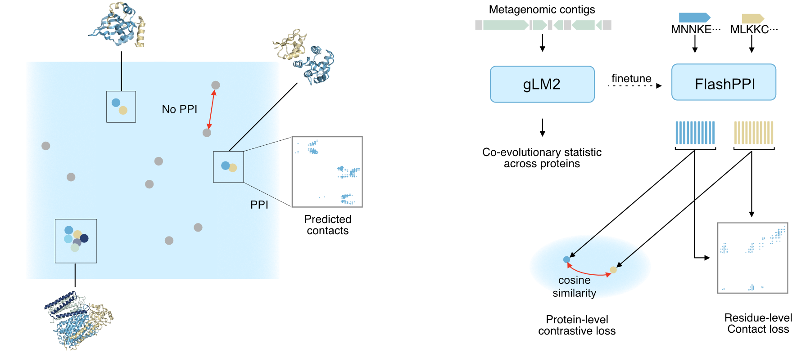

# FlashPPI: Linear-time prediction of proteome-scale microbial protein interactions

<a href="https://www.biorxiv.org/content/10.1101/XXX"></a>
<a href="https://huggingface.co/tattabio/flashppi"></a>



## Model Description
FlashPPI is a contrastively model for protein-protein interaction (PPI) prediction, grounded in residue-level interactions, that enables linear-time prediction across a microbial proteome. 

By reframing interactome mapping as a dense retrieval task, FlashPPI circumvents the $\mathcal{O}(N^2)$ computational bottleneck of traditional all-vs-all structural screening, enabling full-proteome predictions in minutes on a single GPU.

- **Genomic Priors:** Leverages [gLM2](https://huggingface.co/tattabio/gLM2_650M) initialization to capture cross-protein, multi-gene co-evolutionary signals.
- **Interpretable:** Predicts fine-grained, residue-level 2D contact maps for retrieved interaction candidates.
- **Scalable:** Reduces proteome-wide screening from days/months to minutes.


## Installation

```bash
pip install -r requirements.txt
```

Optionally, install [Flash Attention](https://github.com/Dao-AILab/flash-attention) for faster inference on GPU:

```bash
pip install flash-attn --no-build-isolation
```

## Usage

### Fast Proteome-wide PPI Screening (All-vs-All)

Run the prediction script by passing your proteome FASTA file. It will output a predictions file with predicted pairs of interacting proteins and confidence scores.

```bash
python predict_proteome.py --fasta my_proteome.fasta --output predictions.csv
```

### Visualizing contact predictions

```python
import torch
import matplotlib.pyplot as plt
from transformers import AutoModel, AutoTokenizer

seq1 = "MKTAYIAKQRQISFVKSHFSRQL"
seq2 = "MSTAGKVIKCKAAVLW"

device = "cuda" if torch.cuda.is_available() else "cpu"

tokenizer = AutoTokenizer.from_pretrained("tattabio/flashppi", trust_remote_code=True)
model = AutoModel.from_pretrained("tattabio/flashppi", trust_remote_code=True).to(device).eval()

inputs1 = tokenizer(seq1, return_tensors="pt").to(device)
inputs2 = tokenizer(seq2, return_tensors="pt").to(device)

with torch.no_grad():
    outputs = model(
        input_ids1=inputs1["input_ids"],
        attention_mask1=inputs1["attention_mask"],
        input_ids2=inputs2["input_ids"],
        attention_mask2=inputs2["attention_mask"],
        return_dict=True
    )

# Extract map and trim padding
contact_map = outputs.contact_map[0].cpu().numpy()
len1, len2 = inputs1["attention_mask"].sum().item(), inputs2["attention_mask"].sum().item()
contact_map = contact_map[:len1, :len2]

plt.imshow(contact_map, cmap="Blues", vmin=0, vmax=1)
plt.savefig("contact_map.png")
```


## Web Server
You can upload a FASTA and interactively explore whole-proteome FlashPPI networks and contact maps directly at [seqhub.org](https://seqhub.org).


## Citing 
If you use FlashPPI or our datasets in your research, please cite:

```
@article{cornman2026flashppi,
  title={Linear-time prediction of proteome-scale microbial protein interactions},
  author={Cornman, Andre and Tranzillo, Matt and Zulaybar, Nicolo and Bouzit, Imane and Hwang, Yunha},
  journal={bioRxiv},
  year={2026},
  doi={10.1101/XXX}
}
```